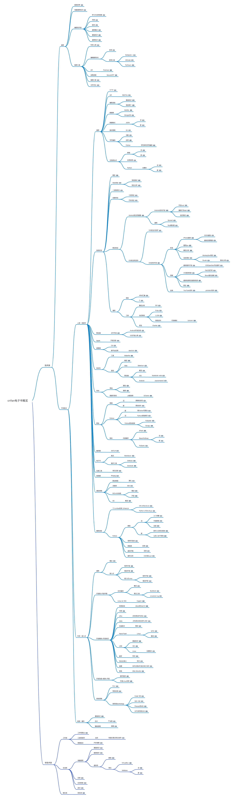

# Crifan的电子书的使用说明

最后更新：`20230713`

---

[toc]

---

## 源码

[crifan/crifan_ebook_readme: Crifan的电子书的使用说明](https://github.com/crifan/crifan_ebook_readme)

## Crifan电子书的简要说明

关于[Crifan](https://www.crifan.org/about/)的电子书，无需细节只关注重点，则只需看此概览：

* 文字版
  * 技术类
    * 通用
      * [提高效率](assets/website/improve_work_efficiency/index.html)---[pdf](assets/pdf/improve_work_efficiency.pdf)
      * [电脑通用知识](assets/website/computer_tech_summary/index.html)---[pdf](assets/pdf/computer_tech_summary.pdf)
      * 编程和开发
        * [学习方法和思路](assets/website/learn_tech_method_experience/index.html)---[pdf](assets/pdf/learn_tech_method_experience.pdf)
        * [风格](assets/website/program_code_style/index.html)---[pdf](assets/pdf/program_code_style.pdf)
        * [规范](assets/website/lan_coding_rule/index.html)---[pdf](assets/pdf/lan_coding_rule.pdf)
        * [通用概念](assets/website/program_common_logic/index.html)---[pdf](assets/pdf/program_common_logic.pdf)
        * [基础知识](assets/website/soft_dev_basic/index.html)---[pdf](assets/pdf/soft_dev_basic.pdf)
        * [通用知识](assets/website/soft_tech_common/index.html)---[pdf](assets/pdf/soft_tech_common.pdf)
      * 推荐工具
        * [科学上网](assets/website/scientific_network_summary/index.html)---[pdf](assets/pdf/scientific_network_summary.pdf)
        * 编辑器和IDE
          * [总结](assets/website/editor_ide_summary/index.html)---[pdf](assets/pdf/editor_ide_summary.pdf)
          * 好用工具
            * [Notepad++](assets/website/rec_soft_npp/index.html)---[pdf](assets/pdf/rec_soft_npp.pdf)
            * [VSCode](assets/website/best_editor_vscode/index.html)---[pdf](assets/pdf/best_editor_vscode.pdf)
            * [PyCharm](assets/website/most_intelligent_python_ide_pycharm/index.html)---[pdf](assets/pdf/most_intelligent_python_ide_pycharm.pdf)
        * API
          * [Postman](assets/website/api_tool_postman/index.html)---[pdf](assets/pdf/api_tool_postman.pdf)
        * 远程连接
          * [SecureCRT](assets/website/rec_soft_securecrt/index.html)---[pdf](assets/pdf/rec_soft_securecrt.pdf)
        * [画图工具](assets/website/best_diagram_tool/index.html)---[pdf](assets/pdf/best_diagram_tool.pdf)
        * [文件对比](assets/website/file_compare_tool_summary/index.html)---[pdf](assets/pdf/file_compare_tool_summary.pdf)
    * 不同层次
      * 上层：纯软件
        * 通用
          * [HTTP](assets/website/http_summary/index.html)---[pdf](assets/pdf/http_summary.pdf)
          * API
            * [RESTful](assets/website/http_restful_api/index.html)---[pdf](assets/pdf/http_restful_api.pdf)
          * 编程语言
            * [基础知识](assets/website/programming_language_basic/index.html)---[pdf](assets/pdf/programming_language_basic.pdf)
            * [语言简介](assets/website/language_summary/index.html)---[pdf](assets/pdf/language_summary.pdf)
          * 数据库
            * [MySQL](assets/website/popular_rmdb_mysql/index.html)---[pdf](assets/pdf/popular_rmdb_mysql.pdf)
            * [MongoDB](assets/website/popular_document_db_mongodb/index.html)---[pdf](assets/pdf/popular_document_db_mongodb.pdf)
          * 数据格式
            * JSON
              * [旧](assets/website/json_tutorial/index.html)---[pdf](assets/pdf/json_tutorial.pdf)
              * [新](assets/website/common_data_format_json/index.html)---[pdf](assets/pdf/common_data_format_json.pdf)
          * 版本管理
            * [Git](assets/website/popular_version_control_git/index.html)---[pdf](assets/pdf/popular_version_control_git.pdf)
          * 字符编码
            * [详解](assets/website/char_encoding/index.html)---[pdf](assets/pdf/char_encoding.pdf)
            * [应用](assets/website/char_encoding_usage/index.html)---[pdf](assets/pdf/char_encoding_usage.pdf)
            * Python
              * [字符串和字符编码](assets/website/python_topic_str_encoding/index.html)---[pdf](assets/pdf/python_topic_str_encoding.pdf)
          * 正则表达式
            * 教程
              * [旧](assets/website/regular_expression/index.html)---[pdf](assets/pdf/regular_expression.pdf)
              * [新](assets/website/super_search_regex/index.html)---[pdf](assets/pdf/super_search_regex.pdf)
            * [应用举例](assets/website/regex_usage_examples/index.html)---[pdf](assets/pdf/regex_usage_examples.pdf)
            * Python
              * re模块
                * [旧](assets/website/python_topic_re/index.html)---[pdf](assets/pdf/python_topic_re.pdf)
                * [新](assets/website/python_regex_re_intro/index.html)---[pdf](assets/pdf/python_regex_re_intro.pdf)
        * 信息安全
          * [概览](assets/website/information_security_overview/index.html)---[pdf](assets/pdf/information_security_overview.pdf)
          * [Web安全](assets/website/avoid_hacker_attack_web_security/index.html)---[pdf](assets/pdf/avoid_hacker_attack_web_security.pdf)
            * [渗透测试](assets/website/infiltrate_your_net_penetration_testing/index.html)---[pdf](assets/pdf/infiltrate_your_net_penetration_testing.pdf)
            * [安全分析](assets/website/grasp_hacker_track_security_analysis/index.html)---[pdf](assets/pdf/grasp_hacker_track_security_analysis.pdf)
          * [二进制安全](assets/website/explore_underlying_mechanism_binary_security/index.html)---[pdf](assets/pdf/explore_underlying_mechanism_binary_security.pdf)
          * 移动安全
            * 通用
              * 语言
                * [ARM汇编](assets/website/popular_assembly_arm/index.html)---[pdf](assets/pdf/popular_assembly_arm.pdf)
              * 静态分析
                * [IDA](assets/website/reverse_tool_ida/index.html)---[pdf](assets/pdf/reverse_tool_ida.pdf)
              * 动态调试
                * [Frida](assets/website/reverse_debug_frida/index.html)---[pdf](assets/pdf/reverse_debug_frida.pdf)
                * [LLDB](assets/website/popular_debugger_lldb/index.html)---[pdf](assets/pdf/popular_debugger_lldb.pdf)
                * 高级逆向
                  * 代码模拟
                    * [Unicorn](assets/website/cpu_emulator_unicorn/index.html)---[pdf](assets/pdf/cpu_emulator_unicorn.pdf)
            * [Android安全和逆向](assets/website/android_app_security_crack/index.html)---[pdf](assets/pdf/android_app_security_crack.pdf)
              * Android逆向
                * [Android逆向开发](assets/website/android_reverse_dev/index.html)---[pdf](assets/pdf/android_reverse_dev.pdf)
                  * [开启root](assets/website/android_re_enable_root/index.html)---[pdf](assets/pdf/android_re_enable_root.pdf)
                  * [重新打包apk](assets/website/android_re_repack_apk/index.html)---[pdf](assets/pdf/android_re_repack_apk.pdf)
                  * [动态调试](assets/website/android_re_dynamic_debug/index.html)---[pdf](assets/pdf/android_re_dynamic_debug.pdf)
            * iOS安全和逆向
              * iOS安全
                * [iOS安全与防护](assets/website/ios_security_protect/index.html)---[pdf](assets/pdf/ios_security_protect.pdf)
              * iOS逆向
                * [iOS逆向开发](assets/website/ios_reverse_dev/index.html)---[pdf](assets/pdf/ios_reverse_dev.pdf)
                  * 典型流程
                    * [iPhone越狱](assets/website/ios_re_iphone_jailbreak/index.html)---[pdf](assets/pdf/ios_re_iphone_jailbreak.pdf)
                      * [iOS15越狱](assets/website/ios_re_ios15_jailbreak/index.html)---[pdf](assets/pdf/ios_re_ios15_jailbreak.pdf)
                      * [包管理器](assets/website/ios_re_package_manager/index.html)---[pdf](assets/pdf/ios_re_package_manager.pdf)
                    * [砸壳ipa](assets/website/ios_re_crack_shell_ipa/index.html)---[pdf](assets/pdf/ios_re_crack_shell_ipa.pdf)
                    * [静态分析](assets/website/ios_re_static_analysis/index.html)---[pdf](assets/pdf/ios_re_static_analysis.pdf)
                    * [动态调试](assets/website/ios_re_dynamic_debug/index.html)---[pdf](assets/pdf/ios_re_dynamic_debug.pdf)
                      * [MonkeyDev](assets/website/ios_re_monkeydev_debug/index.html)---[pdf](assets/pdf/ios_re_monkeydev_debug.pdf)
                      * [Xcode](assets/website/xcode_dev_summary/index.html)---[pdf](assets/pdf/xcode_dev_summary.pdf)
                        * [调试心得](assets/website/xcode_dev_debug_summary/index.html)---[pdf](assets/pdf/xcode_dev_debug_summary.pdf)
                  * 涉及领域
                    * [越狱插件开发](assets/website/ios_re_jailbreak_tweak/index.html)---[pdf](assets/pdf/ios_re_jailbreak_tweak.pdf)
                      * [iOSOpenDev](assets/website/ios_re_iosopendev_tweak/index.html)---[pdf](assets/pdf/ios_re_iosopendev_tweak.pdf)
                    * [iOS底层机制](assets/website/ios_re_ios_internal/index.html)---[pdf](assets/pdf/ios_re_ios_internal.pdf)
                      * [ObjC运行时](assets/website/ios_re_objc_runtime/index.html)---[pdf](assets/pdf/ios_re_objc_runtime.pdf)
                      * [Block匿名函数](assets/website/ios_re_objc_block/index.html)---[pdf](assets/pdf/ios_re_objc_block.pdf)
                    * [越狱检测和反越狱检测](assets/website/ios_re_jb_detection/index.html)---[pdf](assets/pdf/ios_re_jb_detection.pdf)
                    * [断点](assets/website/ios_re_debug_breakpoint/index.html)---[pdf](assets/pdf/ios_re_debug_breakpoint.pdf)
                  * 实例
                    * [YouTube逆向](assets/website/ios_re_youtube_reverse/index.html)---[pdf](assets/pdf/ios_re_youtube_reverse.pdf)
                      * [protobuf逆向](assets/website/ios_re_protobuf_reverse/index.html)---[pdf](assets/pdf/ios_re_protobuf_reverse.pdf)
                  * 相关
                    * 开发语言
                      * [C](assets/website/c_lang_dev_summary/index.html)---[pdf](assets/pdf/c_lang_dev_summary.pdf)
                      * [iOS](assets/website/ios_dev_summary/index.html)---[pdf](assets/pdf/ios_dev_summary.pdf)
          * 设备安全
            * [工控安全](assets/website/industrial_control_security_overview/index.html)---[pdf](assets/pdf/industrial_control_security_overview.pdf)
            * [汽车安全](assets/website/guard_your_car_safety/index.html)---[pdf](assets/pdf/guard_your_car_safety.pdf)
        * 移动端
          * 安卓
            * 辅助工具
              * [Xposed](assets/website/crack_assistant_xposed_framework/index.html)---[pdf](assets/pdf/crack_assistant_xposed_framework.pdf)
              * [Nox模拟器](assets/website/good_android_emulator_nox/index.html)---[pdf](assets/pdf/good_android_emulator_nox.pdf)
        * 自动化
          * 工具
            * [Makefile](assets/website/good_automation_tool_makefile/index.html)---[pdf](assets/pdf/good_automation_tool_makefile.pdf)
          * 测试
            * [概览](assets/website/free_hand_test_automation/index.html)---[pdf](assets/pdf/free_hand_test_automation.pdf)
            * Web
              * [Selenium](assets/website/selenium_summary/index.html)---[pdf](assets/pdf/selenium_summary.pdf)
              * [Playwright](assets/website/web_automation_tool_playwright/index.html)---[pdf](assets/pdf/web_automation_tool_playwright.pdf)
              * [puppeteer](assets/website/web_automation_tool_puppeteer/index.html)---[pdf](assets/pdf/web_automation_tool_puppeteer.pdf)
            * 移动端
              * [概览](assets/website/mobile_automation_overview/index.html)---[pdf](assets/pdf/mobile_automation_overview.pdf)
                * 通用
                  * [Appium](assets/website/popular_automation_framework_appium/index.html)---[pdf](assets/pdf/popular_automation_framework_appium.pdf)
              * Android
                * [uiautomator2](assets/website/android_automation_uiautomator2/index.html)---[pdf](assets/pdf/android_automation_uiautomator2.pdf)
              * iOS
                * [facebook-wda](assets/website/ios_automation_facebook_wda/index.html)---[pdf](assets/pdf/ios_automation_facebook_wda.pdf)
        * 桌面端
          * [C#](assets/website/csharp_summary/index.html)---[pdf](assets/pdf/csharp_summary.pdf)
          * 跨平台应用
            * [Electron](assets/website/desktop_app_framework_electron/index.html)---[pdf](assets/pdf/desktop_app_framework_electron.pdf)
        * Apple
          * [开发总结](assets/website/apple_develop_summary/index.html)---[pdf](assets/pdf/apple_develop_summary.pdf)
        * Web
          * 网站
            * [建站](assets/website/build_website/index.html)---[pdf](assets/pdf/build_website.pdf)
            * [搬家](assets/website/website_transfer/index.html)---[pdf](assets/pdf/website_transfer.pdf)
          * 数据可视化
            * JS图表库
              * [ECharts](assets/website/popular_js_chart_lib_echarts/index.html)---[pdf](assets/pdf/popular_js_chart_lib_echarts.pdf)
        * 移动端
          * [APP开发](assets/website/mobile_app_summary/index.html)---[pdf](assets/pdf/mobile_app_summary.pdf)
        * 爬虫
          * 原理
            * 新
              * [爬虫技术](assets/website/crawl_your_data_spider_technology/index.html)---[pdf](assets/pdf/crawl_your_data_spider_technology.pdf)
            * 旧
              * [原理和实现](assets/website/web_scrape_emulate_login/index.html)---[pdf](assets/pdf/web_scrape_emulate_login.pdf)
          * Python
            * 新
              * [用Python写爬虫](assets/website/use_python_write_spider/index.html)---[pdf](assets/pdf/use_python_write_spider.pdf)
            * 旧
              * [Python抓取网页](assets/website/python_topic_web_scrape/index.html)---[pdf](assets/pdf/python_topic_web_scrape.pdf)
            * Python爬虫框架
              * [PySpider](assets/website/python_spider_pyspider/index.html)---[pdf](assets/pdf/python_spider_pyspider.pdf)
              * [Scrapy](assets/website/python_spider_scrapy/index.html)---[pdf](assets/pdf/python_spider_scrapy.pdf)
          * 相关
            * 内容解析
              * [XPath](assets/website/xpath_summary/index.html)---[pdf](assets/pdf/xpath_summary.pdf)
              * BeautifulSoup
                * [旧](assets/website/python_topic_beautifulsoup/index.html)---[pdf](assets/pdf/python_topic_beautifulsoup.pdf)
                * [新](assets/website/html_parse_tool_beautifulsoup/index.html)---[pdf](assets/pdf/html_parse_tool_beautifulsoup.pdf)
              * [PyQuery](assets/website/python_html_parse_pyquery/index.html)---[pdf](assets/pdf/python_html_parse_pyquery.pdf)
          * 抓包工具
            * [Charles](assets/website/app_capture_package_tool_charles/index.html)---[pdf](assets/pdf/app_capture_package_tool_charles.pdf)
        * 编译器
          * [ANTLR](assets/website/antlr_tutorial/index.html)---[pdf](assets/pdf/antlr_tutorial.pdf)
        * 电子书
          * 格式
            * [Markdown](assets/website/doc_format_markdown/index.html)---[pdf](assets/pdf/doc_format_markdown.pdf)
          * 制作工具
            * [GitBook](assets/website/ebook_system_gitbook/index.html)---[pdf](assets/pdf/ebook_system_gitbook.pdf)
            * [Docbook](assets/website/docbook_dev_note/index.html)---[pdf](assets/pdf/docbook_dev_note.pdf)
        * 压缩工具
          * [常见总结](assets/website/common_compress_tool_summary/index.html)---[pdf](assets/pdf/common_compress_tool_summary.pdf)
        * 音视频
          * [ffmpeg](assets/website/media_process_ffmpeg/index.html)---[pdf](assets/pdf/media_process_ffmpeg.pdf)
        * 通信领域
          * 移动网络
            * [演化](assets/website/mobile_network_evolution_history/index.html)---[pdf](assets/pdf/mobile_network_evolution_history.pdf)
          * 多媒体
            * [IMS](assets/website/multimedia_core_system_ims/index.html)---[pdf](assets/pdf/multimedia_core_system_ims.pdf)
          * RCS=5G消息
            * [概述](assets/website/5g_message_rcs_tech_summary/index.html)---[pdf](assets/pdf/5g_message_rcs_tech_summary.pdf)
            * [开发](assets/website/rcs_tech_dev_summary/index.html)---[pdf](assets/pdf/rcs_tech_dev_summary.pdf)
          * 5G
            * [概览](assets/website/5g_tech_summary/index.html)---[pdf](assets/pdf/5g_tech_summary.pdf)
        * 编程语言
          * 个人crifan的库 CrifanLib
            * [C# crifanLib.cs](assets/website/crifanlib_csharp/index.html)---[pdf](assets/pdf/crifanlib_csharp.pdf)
            * [Python crifanLib.py](assets/website/crifanlib_python/index.html)---[pdf](assets/pdf/crifanlib_python.pdf)
          * Python
            * 教程
              * 旧
                * [入门详解](assets/website/python_beginner_tutorial/index.html)---[pdf](assets/pdf/python_beginner_tutorial.pdf)
                * [中级教程](assets/website/python_intermediate_tutorial/index.html)---[pdf](assets/pdf/python_intermediate_tutorial.pdf)
                * [总结](assets/website/python_summary/index.html)---[pdf](assets/pdf/python_summary.pdf)
              * 新
                * [新手小白常见错误](assets/website/python_newbie_mistakes_questions/index.html)---[pdf](assets/pdf/python_newbie_mistakes_questions.pdf)
                * [让你人生不苦短](assets/website/make_life_better_python/index.html)---[pdf](assets/pdf/make_life_better_python.pdf)
            * [常用代码段](assets/website/python_common_code_snippet/index.html)---[pdf](assets/pdf/python_common_code_snippet.pdf)
            * 网络库
              * [总结](assets/website/python_summary_http_lib/index.html)---[pdf](assets/pdf/python_summary_http_lib.pdf)
            * 虚拟环境
              * [总结](assets/pdf/python_summary_virtual_environment.pdf)
            * 操作文件
              * [CSV和Excel](assets/website/python_process_csv_excel/index.html)---[pdf](assets/pdf/python_process_csv_excel.pdf)
      * 中间：嵌入式
        * 通用
          * [概念](assets/website/common_logic_hardware_embedded/index.html)---[pdf](assets/pdf/common_logic_hardware_embedded.pdf)
          * 嵌入式
            * [软件开发](assets/website/embedded_soft_dev/index.html)---[pdf](assets/pdf/embedded_soft_dev.pdf)
            * [驱动开发](assets/website/embedded_drv_dev/index.html)---[pdf](assets/pdf/embedded_drv_dev.pdf)
            * 嵌入式Linux
              * [软件开发](assets/website/embedded_linux_dev/index.html)---[pdf](assets/pdf/embedded_linux_dev.pdf)
              * [驱动开发](assets/website/embedded_linux_drv_dev/index.html)---[pdf](assets/pdf/embedded_linux_drv_dev.pdf)
        * 开发前=开发环境
          * 交叉编译
            * [概览](assets/website/cross_compile/index.html)---[pdf](assets/pdf/cross_compile.pdf)
            * 常见工具
              * [Buildroot](assets/website/buildroot_intro/index.html)---[pdf](assets/pdf/buildroot_intro.pdf)
              * [crosstool-ng](assets/website/crosstool_ng/index.html)---[pdf](assets/pdf/crosstool_ng.pdf)
          * Linux on Win
            * [Cygwin](assets/website/cygwin_intro/index.html)---[pdf](assets/pdf/cygwin_intro.pdf)
        * 开发期间=开发知识
          * 系统启动
            * [Uboot的start.S](assets/website/uboot_starts_analysis/index.html)---[pdf](assets/pdf/uboot_starts_analysis.pdf)
          * [中断](assets/website/interrupt_related/index.html)---[pdf](assets/pdf/interrupt_related.pdf)
          * CPU
            * [ARM和MIPS对比](assets/website/arm_vs_mips/index.html)---[pdf](assets/pdf/arm_vs_mips.pdf)
          * DMA
            * [ARM的AMBA的PL08X](assets/website/dma_pl08x_analysis/index.html)---[pdf](assets/pdf/dma_pl08x_analysis.pdf)
          * 无线网卡
            * [驱动](assets/website/linux_wireless/index.html)---[pdf](assets/pdf/linux_wireless.pdf)
          * Nand Flash
            * Linux
              * [MTD](assets/website/nand_get_type/index.html)---[pdf](assets/pdf/nand_get_type.pdf)
              * [驱动](assets/website/linux_nand_driver/index.html)---[pdf](assets/pdf/linux_nand_driver.pdf)
          * USB
            * [基础知识](assets/website/usb_basic/index.html)---[pdf](assets/pdf/usb_basic.pdf)
            * [HID](assets/website/usb_hid/index.html)---[pdf](assets/pdf/usb_hid.pdf)
            * Linux
              * [U盘驱动](assets/website/usb_disk_driver/index.html)---[pdf](assets/pdf/usb_disk_driver.pdf)
          * 蓝牙
            * [协议](assets/website/bluetooth_intro/index.html)---[pdf](assets/pdf/bluetooth_intro.pdf)
          * RS232串口
            * [协议](assets/website/rs232_serial_intro/index.html)---[pdf](assets/pdf/rs232_serial_intro.pdf)
          * 音频
            * [MPEG和MP3的CBR/VBR](assets/website/mpeg_vbr/index.html)---[pdf](assets/pdf/mpeg_vbr.pdf)
          * 其他
            * [GNU Binutils](assets/website/binutils_intro/index.html)---[pdf](assets/pdf/binutils_intro.pdf)
        * 开发完成=烧录+升级
          * [固件烧录](assets/website/firmware_download/index.html)---[pdf](assets/pdf/firmware_download.pdf)
          * [升级Linux系统](assets/website/runtime_upgrade_linux/index.html)---[pdf](assets/pdf/runtime_upgrade_linux.pdf)  
        * 其他领域
          * [PLC](assets/website/industrial_automation_plc/index.html)---[pdf](assets/pdf/industrial_automation_plc.pdf)
          * [现场总线](assets/website/fieldbus_intro/index.html)---[pdf](assets/pdf/fieldbus_intro.pdf)
          * 条形码Symbology
            * [Code 128](assets/website/symbology_code128/index.html)---[pdf](assets/pdf/symbology_code128.pdf)
            * [GS1-128](assets/website/symbology_gs1128/index.html)---[pdf](assets/pdf/symbology_gs1128.pdf)
            * [Plessey和MSI](assets/website/symbology_plessey/index.html)---[pdf](assets/pdf/symbology_plessey.pdf)
            * [UPC系列和EAN](assets/website/symbology_upc/index.html)---[pdf](assets/pdf/symbology_upc.pdf)
      * 底层：硬件
        * [基础知识](assets/website/hardware_basic/index.html)---[pdf](assets/pdf/hardware_basic.pdf)
        * 芯片
          * [产业链](assets/website/ic_chip_industry_chain_summary/index.html)---[pdf](assets/pdf/ic_chip_industry_chain_summary.pdf)
        * 智能音箱
          * [拆解](assets/website/smart_speaker_disassemble_summary/index.html)---[pdf](assets/pdf/smart_speaker_disassemble_summary.pdf)
  * 非技术
    * 工作类
      * [工作和职业](assets/website/work_job_summary/index.html)---[pdf](assets/pdf/work_job_summary.pdf)
      * 工具和软件
        * 协作
          * [有道云笔记和云协作](assets/website/youdao_note_summary/index.html)---[pdf](assets/pdf/youdao_note_summary.pdf)
      * 领域知识
        * [汽车销售](assets/website/automobile_sales_summary/index.html)---[pdf](assets/pdf/automobile_sales_summary.pdf)
    * 生活类
      * 电脑使用
        * [基础知识](assets/website/compute_basic/index.html)---[pdf](assets/pdf/compute_basic.pdf)
        * [推荐软件](assets/website/crifan_rec_soft/index.html)---[pdf](assets/pdf/crifan_rec_soft.pdf)
        * 虚拟机
          * [教程](assets/website/virutal_machine_tutorial/index.html)---[pdf](assets/pdf/virutal_machine_tutorial.pdf)
          * 常见
            * [VirtualBox](assets/website/virtualbox_tutorial/index.html)---[pdf](assets/pdf/virtualbox_tutorial.pdf)
            * VMWare
              * [旧](assets/website/vmware_tutorial/index.html)---[pdf](assets/pdf/vmware_tutorial.pdf)
              * [新](assets/website/popular_virtual_machine_vmware/index.html)---[pdf](assets/pdf/popular_virtual_machine_vmware.pdf)
      * [买房](assets/website/buy_house/index.html)---[pdf](assets/pdf/buy_house.pdf)
      * [生活经验](assets/website/resident_life_experience_summary/index.html)---[pdf](assets/pdf/resident_life_experience_summary.pdf)
      * [苏州](assets/website/china_suitable_living_suzhou/index.html)---[pdf](assets/pdf/china_suitable_living_suzhou.pdf)
    * 娱乐类
      * [羽毛球](assets/website/all_age_sports_badminton/index.html)---[pdf](assets/pdf/all_age_sports_badminton.pdf)

## 为何要有：Crifan的电子书

我`Crifan Li`之前折腾过很多方面的内容，包括技术类的和非技术类的。

关于技术类中又分很多种，其中都放到了我的网站 crifan.com 上的[工作和技术](https://www.crifan.org/category/work_and_job/)，目前已有**7000多**的技术帖，但多数内容都是零散的某个细节知识点和某个具体问题的解决过程和结果。

当我在某个技术领域有了一定的心得和经验后，就会抽空整理成相对成系统的内容，用([Docbook](assets/website/docbook_dev_note/index.html)---[pdf](assets/pdf/docbook_dev_note.pdf)、[Gitbook](assets/website/ebook_system_gitbook/index.html)---[pdf](assets/pdf/ebook_system_gitbook.pdf)等)工具去制作出电子书，免费发布出来供别人参考。

目前已经整理出**150多**本成系列的电子书了，接下来详细介绍：

> 另：手上还有**几十本**电子书的内容已基本完成，待之后能抽出时间再尽快整理发布出来。

## 为何要有：Crifan的电子书的使用说明

我写的电子书涵盖范围面较广，需要专门整理后的分门别类的介绍，才有利于他人快速定位到自己所需要参考的内容。

目前所写电子书的总的概览：

* 内容上：主要分两类
  * 一方面：技术类
    * 计算机相关的，技术类，开发类
  * 另一方面：非技术类
    * 生活类的，学习类的，娱乐类等
* 制作工具上：也分两类
  * 一类是（最早）用`Docbook`制作的
    * 主入口：https://www.crifan.com/files/doc/
  * 另一类（后来，现在）是用`Gitbook`制作的
    * 弄了2份一样的，分别发布到
      * 自己的 crifan.com 的网站上
        * 主入口：https://book.crifan.com/books/
      * 和 [GitHub Pages](https://help.github.com/en/articles/what-is-github-pages) 上
        * 主入口：https://crifan.github.io
        * 对应源码：https://github.com/crifan/crifan.github.io
    * `gitbook`电子书的源码
      * 全部源码都已公开放在`github`上了，详见：https://github.com/crifan
      * 如何利用gitbook的源码去创建自己的电子书，可以参考：https://github.com/crifan/gitbook_template

下面详细介绍各个电子书的具体分类和内容简介：

## 技术类

从大的概念上来说，计算机的技术可以大致分为：

* **上层：纯软件**
  * 涉及到在PC（Windows/Mac/Linux）上，用各种编辑器/IDE，去编写各种代码，实现各种工具/软件/脚本等内容
  * 包括PC桌面端软件，Web领域网页开发，移动端APP开发等等
* **中间：**（软硬件结合的）**嵌入式**
  * 涉及到在某某开发板上，写嵌入式代码，驱动硬件工作
  * 包括给别人的芯片或开发板，去写某BSP，某个模块（蓝牙，USB，FM，Nand Flash等）的驱动
* **底层：纯硬件**
  * 涉及PCB Layout，设计和生产开发版
  * 涉及到各种芯片的涉及，包括CPU，内存，显示屏等，涉及到流水线，代工厂等等内容

自己主要涉及的领域是：

**中间的嵌入式** 和 **上层的纯软件**

### 技术类通用知识

不论哪方面的技术，都有一些通用的学习方面，逻辑概念，总结如下：

* 关于如何学习和利用网络资料，以及一些技术方面的心得体会和总结：
  * [学习方法思路及技术心得总结](assets/website/learn_tech_method_experience/index.html)---[pdf](assets/pdf/learn_tech_method_experience.pdf)
* 关于如何利用工具和脚本提供工作效率的：
  * [如何提高工作效率](assets/website/improve_work_efficiency/index.html)---[pdf](assets/pdf/improve_work_efficiency.pdf)
* 关于要有良好的编程习惯和逻辑，才能写出高质量代码：
  * [编程习惯和代码风格](assets/website/program_code_style/index.html)---[pdf](assets/pdf/program_code_style.pdf)
  * [计算机语言编程规范](assets/pdf/lan_coding_rule.pdf)
* 对于不同领域的技术，都有一些通用的概念需要了解，才能更好的开发：
  * [计算机编程通用逻辑知识概念](assets/website/program_common_logic/index.html)---[pdf](assets/pdf/program_common_logic.pdf)
* 以及都有一些通知的基础知识：
  * [软件开发基础知识](assets/website/soft_dev_basic/index.html)---[pdf](assets/pdf/soft_dev_basic.pdf)
  * [软件技术开发通用知识](assets/website/soft_tech_common/index.html)---[pdf](assets/pdf/soft_tech_common.pdf)
* 对于计算机，或者说电脑，各种不同类型系统都有一些通用的基础知识：
  * [计算机电脑知识总结](assets/website/computer_tech_summary/index.html)---[pdf](assets/pdf/computer_tech_summary.pdf)

### 推荐的工具或软件

做各种领域的技术开发，甚至非技术方面的工作，都会涉及到一些好用的工具和利器，现整理如下：

#### 科学上网

想要用外网，比如用google等搜索技术资料，可以使用shadowsocks：

* [科学上网相关知识总结](assets/website/scientific_network_summary/index.html)---[pdf](assets/pdf/scientific_network_summary.pdf)

#### 编辑器和IDE

关于编辑器和IDE的概览和总结：

[编辑器和IDE总结](assets/website/editor_ide_summary/index.html)---[pdf](assets/pdf/editor_ide_summary.pdf)

##### 好用的编辑器和IDE

之前Windows下觉得最好用的编辑器Notepad++：

* [【crifan推荐】轻量级文本编辑器，Notepad最佳替代品：Notepad++](assets/website/rec_soft_npp/index.html)---[pdf](assets/pdf/rec_soft_npp.pdf)

现在觉得更好用的、最好用的编辑器（甚至可称之为IDE）：VSCode：

* [史上最好用的编辑器：VSCode](assets/website/best_editor_vscode/index.html)---[pdf](assets/pdf/best_editor_vscode.pdf)

Python开发中最专业的IDE：

* [最智能的Python的IDE：PyCharm](assets/website/most_intelligent_python_ide_pycharm/index.html)---[pdf](assets/pdf/most_intelligent_python_ide_pycharm.pdf)

#### 画图工具软件

涉及到画路程图、结构图、架构图等，可以参考：

[好用的画图工具](assets/website/best_diagram_tool/index.html)---[pdf](assets/pdf/best_diagram_tool.pdf)

去选择合适的画图工具。

#### 文件对比工具

如果需要对比文件、文件夹中的内容，可以参考：

[文件内容对比工具总结](assets/website/file_compare_tool_summary/index.html)---[pdf](assets/pdf/file_compare_tool_summary.pdf)

#### API接口测试

后端人员，移动端开发人员，测试人员等涉及调试api接口时，可以用Postman：

* [API开发利器：Postman](assets/website/api_tool_postman/index.html)---[pdf](assets/pdf/api_tool_postman.pdf)

#### ssh远程连接工具

通过SSH连接远程服务器的工具方面，常用SecureCRT：

* [【crifan推荐】支持多种协议的串口开发工具：SecureCRT](assets/website/rec_soft_securecrt/index.html)---[pdf](assets/pdf/rec_soft_securecrt.pdf)

#### 代码版本管理

当前最流行的是`Git`：

* [最流行的版本管理系统：Git](assets/website/popular_version_control_git/index.html)---[pdf](assets/pdf/popular_version_control_git.pdf)

### 硬件类

折腾嵌入式期间，其实也想去了解硬件方面的知识，只不过没有深入。

只整理了点和硬件相关的皮毛：

* [硬件电路基础知识](assets/website/hardware_basic/index.html)---[pdf](assets/pdf/hardware_basic.pdf)

之前拆过智能音箱，然后总结了相关各种细节：

* [智能音箱拆解总结](assets/website/smart_speaker_disassemble_summary/index.html)---[pdf](assets/pdf/smart_speaker_disassemble_summary.pdf)

且在拆解期间又去整理了芯片和产业链的相关知识：

* [芯片产业链总结](assets/website/ic_chip_industry_chain_summary/index.html)---[pdf](assets/pdf/ic_chip_industry_chain_summary.pdf)

### 嵌入式软件

下面是之前折腾的嵌入式开发相关的内容：

嵌入式领域（包括很多硬件反面）都有些通用的基础知识和概念：

* [硬件和嵌入式通用逻辑知识概念](assets/website/common_logic_hardware_embedded/index.html)---[pdf](assets/pdf/common_logic_hardware_embedded.pdf)

关于CPU方面的：

* [ARM与MIPS的详细对比](assets/website/arm_vs_mips/index.html)---[pdf](assets/pdf/arm_vs_mips.pdf)

和技术和概念相关的，比如：

* [【详解】中断相关的知识](assets/website/interrupt_related/index.html)---[pdf](assets/pdf/interrupt_related.pdf)

#### 开发环境+交叉编译器

在折腾嵌入式相关开发前，往往要先去搭建开发环境，其中就要先去搞懂：交叉编译

先去搞清楚什么是交叉编译：

* [交叉编译详解](assets/website/cross_compile/index.html)---[pdf](assets/pdf/cross_compile.pdf)

然后再去了解相关的GNU方面的工具：

* [GNU Binutils详解](assets/website/binutils_intro/index.html)---[pdf](assets/pdf/binutils_intro.pdf)

然后再去用具体的某个工具，去搭建交叉编译环境（和相关的工具链、rootfs等内容）：

* [Buildroot详解](assets/website/buildroot_intro/index.html)---[pdf](assets/pdf/buildroot_intro.pdf)
* [crosstool-ng详解](assets/website/crosstool_ng/index.html)---[pdf](assets/pdf/crosstool_ng.pdf)

关于开发环境的：

在Windows上折腾Linux方面的开发，用Cygiwn：

* [Cygwin详解](assets/website/cygwin_intro/index.html)---[pdf](assets/pdf/cygwin_intro.pdf)

#### 嵌入式Linux+嵌入式Linux驱动

如果对于嵌入式软件的整体概念不了解，可以去看：

* [嵌入式软件开发](assets/website/embedded_soft_dev/index.html)---[pdf](assets/pdf/embedded_soft_dev.pdf)

如果想要了解嵌入式软件中关于驱动开发的事情，可以去看：

* [嵌入式驱动开发](assets/website/embedded_drv_dev/index.html)---[pdf](assets/pdf/embedded_drv_dev.pdf)

而关于嵌入式Linux方面的软件和软件中的驱动，可以去看：

* [嵌入式Linux软件开发](assets/website/embedded_linux_dev/index.html)---[pdf](assets/pdf/embedded_linux_dev.pdf)
* [嵌入式Linux驱动开发](assets/website/embedded_linux_drv_dev/index.html)---[pdf](assets/pdf/embedded_linux_drv_dev.pdf)

关于嵌入式Linux开发期间的，有：

* [【详解】嵌入式开发中固件的烧录方式](assets/website/firmware_download/index.html)---[pdf](assets/pdf/firmware_download.pdf)
* [在Linux运行期间升级Linux系统（Uboot+kernel+Rootfs）](assets/website/runtime_upgrade_linux/index.html)---[pdf](assets/pdf/runtime_upgrade_linux.pdf)

而关于典型的Uboot+Kernel+Rootfs的嵌入式Linux中的Uboot：

其中的最开始的启动代码相关的Start.S的汇编代码，实现了启动硬件的功能。

而关于启动的逻辑的具体分析：

* [Uboot中start.S源码的指令级的详尽解析](assets/website/uboot_starts_analysis/index.html)---[pdf](assets/pdf/uboot_starts_analysis.pdf)

而关于具体的某个模块/功能方面的驱动有：

关于DMA的驱动：

* [详解ARM的AMBA设备中的DMA设备PL08X的Linux驱动](assets/website/dma_pl08x_analysis/index.html)---[pdf](assets/pdf/dma_pl08x_analysis.pdf)

关于无线网卡的驱动：

* [如何在Linux下写无线网卡的驱动](assets/website/linux_wireless/index.html)---[pdf](assets/pdf/linux_wireless.pdf)

关于Nand Flash方面的驱动和介绍：

* [【详解】如何编写Linux下Nand Flash驱动](assets/website/linux_nand_driver/index.html)---[pdf](assets/pdf/linux_nand_driver.pdf)

而其中Linux中关于Nand Flash的是MTD层，MTD中关于如何识别Nand Flash和启动过程的解析是：

* [Linux MTD下获取Nand flash各个参数的过程的详细解析](assets/website/nand_get_type/index.html)---[pdf](assets/pdf/nand_get_type.pdf)

而关于USB方面的协议介绍和相关驱动开发总结是：

* [USB基础知识概论](assets/website/usb_basic/index.html)---[pdf](assets/pdf/usb_basic.pdf)
* [如何实现Linux下的U盘（USB Mass Storage）驱动](assets/website/usb_disk_driver/index.html)---[pdf](assets/pdf/usb_disk_driver.pdf)
* [USB HID Learning Record](assets/website/usb_hid/index.html)---[pdf](assets/pdf/usb_hid.pdf)

#### 具体模块或领域

##### PLC

此处暂时把PLC归为嵌入式大类。

关于PLC的知识的总结：

[工控自动化技术：PLC](assets/website/industrial_automation_plc/index.html)---[pdf](assets/pdf/industrial_automation_plc.pdf)

##### 大的方向=嵌入式的不同应用领域

* [现场总线Fieldbus简析](assets/website/fieldbus_intro/index.html)---[pdf](assets/pdf/fieldbus_intro.pdf)

条形码Symbology相关的，各种不同类型的条形码的总结：

* [Code 128 Symbology Introduction](assets/website/symbology_code128/index.html)---[pdf](assets/pdf/symbology_code128.pdf)
* [GS1-128条形码和相关的AI及FNC1的详解](assets/website/symbology_gs1128/index.html)---[pdf](assets/pdf/symbology_gs1128.pdf)
* [Plessey & MSI Symbology Introduction](assets/website/symbology_plessey/index.html)---[pdf](assets/pdf/symbology_plessey.pdf)
* [UPC/UPC-A/UPC-E & EAN Barcode Symbology](assets/website/symbology_upc/index.html)---[pdf](assets/pdf/symbology_upc.pdf)

##### 小方面来说=关于具体的模块/硬件/协议方面

关于蓝牙的：

* [蓝牙协议详解](assets/website/bluetooth_intro/index.html)---[pdf](assets/pdf/bluetooth_intro.pdf)

关于串口/RS232的：

* [RS232串口协议详解](assets/website/rs232_serial_intro/index.html)---[pdf](assets/pdf/rs232_serial_intro.pdf)

关于音频领域的：

关于MPEG和MP3的知识：

* [MPEG简介 + 如何计算CBR和VBR的MP3的播放时间](assets/website/mpeg_vbr/index.html)---[pdf](assets/pdf/mpeg_vbr.pdf)

### 上层软件

对于上层纯软件方面，也有一些总结：

#### 上层软件的通用知识

关于后台开发和设计接口，移动端调用后台接口，测试人员测试接口和网页等相关的：

和HTTP方面的知识：

* [HTTP知识总结](assets/website/http_summary/index.html)---[pdf](assets/pdf/http_summary.pdf)

以及后台人员设计RESTFul的API接口需要了解的：

* [HTTP后台端：RESTful API接口设计](assets/website/http_restful_api/index.html)---[pdf](assets/pdf/http_restful_api.pdf)

各种计算机语言通用的的方面的知识总结：

* [计算机编程语言基础知识](assets/website/programming_language_basic/index.html)---[pdf](assets/pdf/programming_language_basic.pdf)
* [各种计算机语言简介和总结](assets/website/language_summary/index.html)---[pdf](assets/pdf/language_summary.pdf)

在涉及到前台和后台数据交互，常用数据格式是JSON：

* 旧教程
  * [JSON详解](assets/website/json_tutorial/index.html)---[pdf](assets/pdf/json_tutorial.pdf)
* 新教程
  * [主流数据格式：JSON](assets/website/common_data_format_json/index.html)---[pdf](assets/pdf/common_data_format_json.pdf)

##### 字符编码

而用不同的编辑器或IDE，以及处理文件相关的内容时，往往会涉及到文件的字符编码，可参考：

* [字符编码详解](assets/website/char_encoding/index.html)---[pdf](assets/pdf/char_encoding.pdf)

而上面的教程内容太多太杂，如果只是想要简单的使用编码方面的知识，可以直接去看：

* [字符编码应用](assets/website/char_encoding_usage/index.html)---[pdf](assets/pdf/char_encoding_usage.pdf)

##### 正则表达式

不同的语言和工具中，都支持用正则表达式去实现复杂的规则去提取想要的数据。可以参考：

* 之前用docbook写的旧教程：
  * [正则表达式学习心得](assets/website/regular_expression/index.html)---[pdf](assets/pdf/regular_expression.pdf)
* 后来用gitbook写的新教程
  * [应用广泛的超强搜索：正则表达式](assets/website/super_search_regex/index.html)---[pdf](assets/pdf/super_search_regex.pdf)
  * 以及实际的使用案例：
    * [正则表达式应用举例](assets/website/regex_usage_examples/index.html)---[pdf](assets/pdf/regex_usage_examples.pdf)

#### 信息安全

需要先对信息安全领域有个总体的了解，可参考我自己边学边整理出的：

* [信息安全概览](assets/website/information_security_overview/index.html)---[pdf](assets/pdf/information_security_overview.pdf)

然后再去分别了解不同领域内的安全技术：

##### Web安全

其中侧总基于浏览器的、Web相关的安全是：

* [防止被黑客攻击：Web安全](assets/website/avoid_hacker_attack_web_security/index.html)---[pdf](assets/pdf/avoid_hacker_attack_web_security.pdf)

其中Web安全包含几个主要方面：

* 渗透测试
  * [潜入你的网络：渗透测试](assets/website/infiltrate_your_net_penetration_testing/index.html)---[pdf](assets/pdf/infiltrate_your_net_penetration_testing.pdf)
* 模糊测试
* 安全(日志)分析
  * [掌握黑客的行踪：安全分析](assets/website/grasp_hacker_track_security_analysis/index.html)---[pdf](assets/pdf/grasp_hacker_track_security_analysis.pdf)

##### 二进制安全

二进制安全，也称`PWN`，主要侧重点是操作系统的底层机制：

* [探究底层机制：二进制安全](assets/website/explore_underlying_mechanism_binary_security/index.html)---[pdf](assets/pdf/explore_underlying_mechanism_binary_security.pdf)

其中对于Windows系统，就是常说的Windows的漏洞和挖掘等方向。

##### 设备安全

对于`设备安全`~=`物联网安全`，包含几个子领域=不同侧重点：

* 工控领域
  * [工控安全概览](assets/website/industrial_control_security_overview/index.html)---[pdf](assets/pdf/industrial_control_security_overview.pdf)
* 汽车领域
  * [守护你的座驾：汽车安全](assets/website/guard_your_car_safety/index.html)---[pdf](assets/pdf/guard_your_car_safety.pdf)

##### 移动端安全和逆向

爬取安卓app的数据期间，折腾过如何破解安卓，后整理心得如下：

* [安卓应用的安全和破解](assets/website/android_app_security_crack/index.html)---[pdf](assets/pdf/android_app_security_crack.pdf)

以及辅助工具：

* [强大的安卓破解辅助工具：XPosed框架](assets/website/crack_assistant_xposed_framework/index.html)---[pdf](assets/pdf/crack_assistant_xposed_framework.pdf)
* [好用的安卓模拟器：夜神Nox](assets/website/good_android_emulator_nox/index.html)---[pdf](assets/pdf/good_android_emulator_nox.pdf)

后来整理出移动端安全和逆向的成套的教程：

* 通用
  * 编程语言
    * 汇编
      * [最流行汇编语言：ARM](assets/website/popular_assembly_arm/index.html)---[pdf](assets/pdf/popular_assembly_arm.pdf)
    * 高级语言
      * [C语言开发心得](assets/website/c_lang_dev_summary/index.html)---[pdf](assets/pdf/c_lang_dev_summary.pdf)
  * 静态分析
    * [逆向利器：IDA](assets/website/reverse_tool_ida/index.html)---[pdf](assets/pdf/reverse_tool_ida.pdf)
  * 动态调试
    * [逆向调试利器：Frida](assets/website/reverse_debug_frida/index.html)---[pdf](assets/pdf/reverse_debug_frida.pdf)
    * [主流调试器：LLDB](assets/website/popular_debugger_lldb/index.html)---[pdf](assets/pdf/popular_debugger_lldb.pdf)
    * 高级逆向
      * 代码模拟
        * [CPU模拟利器：Unicorn](assets/website/cpu_emulator_unicorn/index.html)---[pdf](assets/pdf/cpu_emulator_unicorn.pdf)
* Android安全和逆向
  * Android逆向
    * [Android逆向开发](assets/website/android_reverse_dev/index.html)---[pdf](assets/pdf/android_reverse_dev.pdf)
      * [Android逆向：开启root](assets/website/android_re_enable_root/index.html)---[pdf](assets/pdf/android_re_enable_root.pdf)
      * [Android逆向：重新打包apk](assets/website/android_re_repack_apk/index.html)---[pdf](assets/pdf/android_re_repack_apk.pdf)
      * [Android逆向：动态调试](assets/website/android_re_dynamic_debug/index.html)---[pdf](assets/pdf/android_re_dynamic_debug.pdf)
* iOS安全和逆向
  * iOS安全
    * [iOS安全与防护](assets/website/ios_security_protect/index.html)---[pdf](assets/pdf/ios_security_protect.pdf)
  * iOS逆向
    * [iOS逆向开发](assets/website/ios_reverse_dev/index.html)---[pdf](assets/pdf/ios_reverse_dev.pdf)
      * 系列
        * 典型流程
          * [iOS逆向开发：iPhone越狱](assets/website/ios_re_iphone_jailbreak/index.html)---[pdf](assets/pdf/ios_re_iphone_jailbreak.pdf)
            * [iOS逆向：iOS15越狱](assets/website/ios_re_ios15_jailbreak/index.html)---[pdf](assets/pdf/ios_re_ios15_jailbreak.pdf)
            * [iOS逆向开发：越狱包管理器](assets/website/ios_re_package_manager/index.html)---[pdf](assets/pdf/ios_re_package_manager.pdf)
          * [iOS逆向开发：砸壳ipa](assets/website/ios_re_crack_shell_ipa/index.html)---[pdf](assets/pdf/ios_re_crack_shell_ipa.pdf)
          * [iOS逆向开发：静态分析](assets/website/ios_re_static_analysis/index.html)---[pdf](assets/pdf/ios_re_static_analysis.pdf)
          * [iOS逆向开发：动态调试](assets/website/ios_re_dynamic_debug/index.html)---[pdf](assets/pdf/ios_re_dynamic_debug.pdf)
            * [iOS逆向开发：MonkeyDev调试](assets/website/ios_re_monkeydev_debug/index.html)---[pdf](assets/pdf/ios_re_monkeydev_debug.pdf)
            * [Xcode开发心得](assets/website/xcode_dev_summary/index.html)---[pdf](assets/pdf/xcode_dev_summary.pdf)
              * [Xcode开发：调试心得](assets/website/xcode_dev_debug_summary/index.html)---[pdf](assets/pdf/xcode_dev_debug_summary.pdf)
        * 涉及领域
          * [iOS逆向开发：越狱插件开发](assets/website/ios_re_jailbreak_tweak/index.html)---[pdf](assets/pdf/ios_re_jailbreak_tweak.pdf)
            * [iOS逆向开发：iOSOpenDev开发插件](assets/website/ios_re_iosopendev_tweak/index.html)---[pdf](assets/pdf/ios_re_iosopendev_tweak.pdf)
          * [iOS逆向开发：iOS底层机制](assets/website/ios_re_ios_internal/index.html)---[pdf](assets/pdf/ios_re_ios_internal.pdf)
            * [iOS逆向开发：ObjC运行时](assets/website/ios_re_objc_runtime/index.html)---[pdf](assets/pdf/ios_re_objc_runtime.pdf)
            * [iOS逆向开发：Block匿名函数](assets/website/ios_re_objc_block/index.html)---[pdf](assets/pdf/ios_re_objc_block.pdf)
          * [iOS逆向开发：越狱检测和反越狱检测](assets/website/ios_re_jb_detection/index.html)---[pdf](assets/pdf/ios_re_jb_detection.pdf)
          * [iOS逆向之动态调试：断点](assets/website/ios_re_debug_breakpoint/index.html)---[pdf](assets/pdf/ios_re_debug_breakpoint.pdf)
        * 实例
          * [iOS逆向开发：YouTube逆向](assets/website/ios_re_youtube_reverse/index.html)---[pdf](assets/pdf/ios_re_youtube_reverse.pdf)
            * [iOS逆向YouTube：protobuf逆向](assets/website/ios_re_protobuf_reverse/index.html)---[pdf](assets/pdf/ios_re_protobuf_reverse.pdf)
      * 相关
        * 开发语言
          * [iOS开发心得](assets/website/ios_dev_summary/index.html)---[pdf](assets/pdf/ios_dev_summary.pdf)

#### 自动化

##### 把工作自动化的工具

不论是嵌入式还是上层软件，都可以用一些工具，从手动变自动，去提高做事效率，比如Makefile：

* [自动化利器：Makefile](assets/website/good_automation_tool_makefile/index.html)---[pdf](assets/pdf/good_automation_tool_makefile.pdf)

##### 自动化测试

对于自动化测试，先看概览以了解有哪些子领域：

* [自动化测试概览](assets/website/free_hand_test_automation/index.html)---[pdf](assets/pdf/free_hand_test_automation.pdf)

然后再去了解不同子领域：

* Web端
  * Web领域的自动化测试，也叫Web网页自动化，往往也属于爬虫领域，常用工具有
    * Selenium
      * [Selenium知识总结](assets/website/selenium_summary/index.html)---[pdf](assets/pdf/selenium_summary.pdf)
    * Playwright
      * [跨平台Web自动化神器：Playwright](assets/website/web_automation_tool_playwright/index.html)---[pdf](assets/pdf/web_automation_tool_playwright.pdf)
    * puppeteer
      * [Web前端自动化利器：puppeteer](assets/website/web_automation_tool_puppeteer/index.html)---[pdf](assets/pdf/web_automation_tool_puppeteer.pdf)
* 移动端
  * 先了解概况
    * [移动端自动化测试概览](assets/website/mobile_automation_overview/index.html)---[pdf](assets/pdf/mobile_automation_overview.pdf)
  * 再看具体的不同方向的工具
    * 通用=跨平台
      * [主流跨平台自动化框架：Appium](assets/website/popular_automation_framework_appium/index.html)---[pdf](assets/pdf/popular_automation_framework_appium.pdf)
    * Android端
      * 安卓端的话，可以用`uiautomator2`
        * [安卓自动化测试利器：uiautomator2](assets/website/android_automation_uiautomator2/index.html)---[pdf](assets/pdf/android_automation_uiautomator2.pdf)
    * iOS端
      * 关于iOS端的自动化测试，可以考虑用`facebook-wda`：
        * [iOS自动化测试利器：facebook-wda](assets/website/ios_automation_facebook_wda/index.html)---[pdf](assets/pdf/ios_automation_facebook_wda.pdf)

#### PC桌面端软件

在写Windows平台的桌面端软件时，可以使用`C#`：

* [C#学习心得](assets/website/csharp_summary/index.html)---[pdf](assets/pdf/csharp_summary.pdf)

如果想要开发跨平台的桌面端应用，可以考虑选用`Electron`：

* [跨平台桌面应用框架：Electron](assets/website/desktop_app_framework_electron/index.html)---[pdf](assets/pdf/desktop_app_framework_electron.pdf)

#### 苹果系统

苹果的`Mac`、`iOS`等相关开发总结：

[苹果相关开发总结](assets/website/apple_develop_summary/index.html)---[pdf](assets/pdf/apple_develop_summary.pdf)

#### 网页Web领域开发

关于如何搭建网站，以及如何给网站搬家的话，可以参考：

* [建设网站详细教程](assets/website/build_website/index.html)---[pdf](assets/pdf/build_website.pdf)
* [网站搬家详解](assets/website/website_transfer/index.html)---[pdf](assets/pdf/website_transfer.pdf)

在数据可视化方面，有很多JS图形库，图标库，其中主流的有：

* [流行的JS图表库：ECharts](assets/website/popular_js_chart_lib_echarts/index.html)---[pdf](assets/pdf/popular_js_chart_lib_echarts.pdf)

#### 移动端APP开发

在涉及到移动端开发时，可以参考：

* [移动端APP开发总结](assets/website/mobile_app_summary/index.html)---[pdf](assets/pdf/mobile_app_summary.pdf)

后续整理出了，不同端的开发总结：

* Android
  * [Android开发总结](assets/website/android_dev_summary/index.html)---[pdf](assets/pdf/android_dev_summary.pdf)
* iOS
  * [iOS开发心得](assets/website/ios_dev_summary/index.html)---[pdf](assets/pdf/ios_dev_summary.pdf)

#### 爬虫

折腾网络爬虫（和模拟登录）领域的话，可以先去了解宏观逻辑和概念：

* [爬取你要的数据：爬虫技术](assets/website/crawl_your_data_spider_technology/index.html)---[pdf](assets/pdf/crawl_your_data_spider_technology.pdf)

再去选择合适的语言去写爬虫，比如目前最适合的是Python：

* [如何用Python写爬虫](assets/website/use_python_write_spider/index.html)---[pdf](assets/pdf/use_python_write_spider.pdf)

然后才涉及到基于某语言（Python）去具体选择什么框架（PySpider），以提高爬虫效率：

* [Python爬虫框架：PySpider](assets/website/python_spider_pyspider/index.html)---[pdf](assets/pdf/python_spider_pyspider.pdf)
* [主流Python爬虫框架：Scrapy](assets/website/python_spider_scrapy/index.html)---[pdf](assets/pdf/python_spider_scrapy.pdf)

在爬虫领域内涉及到提取内容时，往往才会涉及到Xpath：

* [XPath知识总结](assets/website/xpath_summary/index.html)---[pdf](assets/pdf/xpath_summary.pdf)

如果想要抓包app时可以用：

* [app抓包利器：Charles](assets/website/app_capture_package_tool_charles/index.html)---[pdf](assets/pdf/app_capture_package_tool_charles.pdf)

另外，之前也写过相关的爬虫方面的资料：

* [详解抓取网站，模拟登陆，抓取动态网页的原理和实现（Python，C#等）](assets/website/web_scrape_emulate_login/index.html)---[pdf](assets/pdf/web_scrape_emulate_login.pdf)
* [Python专题教程：抓取网站，模拟登陆，抓取动态网页](assets/website/python_topic_web_scrape/index.html)---[pdf](assets/pdf/python_topic_web_scrape.pdf)

#### 通信领域

在移动通信网络中，总体网络从1G到5G的演化，可以参考：

* [移动网络演化史](assets/website/mobile_network_evolution_history/index.html)---[pdf](assets/pdf/mobile_network_evolution_history.pdf)

期间出现了相关技术：

* (RCS底层所依赖的技术)IMS
  * [多媒体业务核心子系统：IMS](assets/website/multimedia_core_system_ims/index.html)---[pdf](assets/pdf/multimedia_core_system_ims.pdf)
* RCS
  * 概览
    * [5G消息RCS技术总结](assets/website/5g_message_rcs_tech_summary/index.html)---[pdf](assets/pdf/5g_message_rcs_tech_summary.pdf)
  * 开发
    * [RCS技术开发总结](assets/website/rcs_tech_dev_summary/index.html)---[pdf](assets/pdf/rcs_tech_dev_summary.pdf)

而最新的5G技术，总体概览如下：

* [5G技术概述](assets/website/5g_tech_summary/index.html)---[pdf](assets/pdf/5g_tech_summary.pdf)

#### 上层软件的其他领域

比如想要开发自己特定领域内的语言的解析器，即实现自己的编译器，可以使用ANTLR：

* [ANTLR教程](assets/website/antlr_tutorial/index.html)---[pdf](assets/pdf/antlr_tutorial.pdf)

想要和我一样去制作出复杂的电子书，则可以：

先学习通用的语法格式Markdown：

* [最流行的文档格式：Markdown](assets/website/doc_format_markdown/index.html)---[pdf](assets/pdf/doc_format_markdown.pdf)

再去使用相对简单好用的工具GitBook去制作电子书：

* [电子书制作利器：GitBook](assets/website/ebook_system_gitbook/index.html)---[pdf](assets/pdf/ebook_system_gitbook.pdf)
  * 如果想要更简单易用更省心，可以基于我的[Gitbook的模板](https://github.com/crifan/gitbook_template)去制作，生成的效果是[Gitbook演示](assets/website/gitbook_demo/index.html)---[pdf](assets/pdf/gitbook_demo.pdf)

不过gitbook官网放弃维护，所以换用兼容和集成自`Gitbook`的`HonKit`：

* [crifan/honkit_template: 用于创建HonKit电子书的HonKit的模板](https://github.com/crifan/honkit_template)

也可以用更加强大但非常复杂的，技术类书籍专业制作工具Docbook：

* [Docbook开发手记](assets/website/docbook_dev_note/index.html)---[pdf](assets/pdf/docbook_dev_note.pdf)

在数据库方面，主流的文档数据库有：

* [主流关系数据库：MySQL](assets/website/popular_rmdb_mysql/index.html)---[pdf](assets/pdf/popular_rmdb_mysql.pdf)
* [主流文档型数据库：MongoDB](assets/website/popular_document_db_mongodb/index.html)---[pdf](assets/pdf/popular_document_db_mongodb.pdf)

不同系统中都会涉及到文件和代码等压缩，可以参考：

* [常见压缩工具总结](assets/website/common_compress_tool_summary/index.html)---[pdf](assets/pdf/common_compress_tool_summary.pdf)

如果涉及到音视频的处理，可以用强大的`ffmpeg`：

* [强大的音视频处理工具：ffmpeg](assets/website/media_process_ffmpeg/index.html)---[pdf](assets/pdf/media_process_ffmpeg.pdf)

#### Python语言

折腾折腾Pyton期间，单独整理了一系列的内容，供参考：

* 旧的
  * 用于入门级的介绍的：
    * [python初级教程：入门详解](assets/website/python_beginner_tutorial/index.html)---[pdf](assets/pdf/python_beginner_tutorial.pdf)
  * 关于整体的Python的心得和总结：
    * [python中级教程：开发总结](assets/website/python_intermediate_tutorial/index.html)---[pdf](assets/pdf/python_intermediate_tutorial.pdf)
    * [Python语言总结](assets/website/python_summary/index.html)---[pdf](assets/pdf/python_summary.pdf)
  * 关于某个特定的模块的总结：
    * BeautifulSoup
      * 旧教程
        * [Python专题教程：BeautifulSoup详解](assets/website/python_topic_beautifulsoup/index.html)---[pdf](assets/pdf/python_topic_beautifulsoup.pdf)
      * 新教程
        * [网页解析利器：BeautifulSoup](assets/website/html_parse_tool_beautifulsoup/index.html)---[pdf](assets/pdf/html_parse_tool_beautifulsoup.pdf)
    * PyQuery
      * [HTML解析库Python版jQuery：PyQuery](assets/website/python_html_parse_pyquery/index.html)---[pdf](assets/pdf/python_html_parse_pyquery.pdf)
    * re模块
      * 旧的
        * [Python专题教程：正则表达式re模块详解](assets/website/python_topic_re/index.html)---[pdf](assets/pdf/python_topic_re.pdf)
      * 新的
        * [Python中正则表达式：re模块详解](assets/website/python_regex_re_intro/index.html)---[pdf](assets/pdf/python_regex_re_intro.pdf)
    * 字符编码
      * [Python专题教程：字符串和字符编码](assets/website/python_topic_str_encoding/index.html)---[pdf](assets/pdf/python_topic_str_encoding.pdf)
    * 网络库
      * [Python心得：http网络库](assets/website/python_summary_http_lib/index.html)---[pdf](assets/pdf/python_summary_http_lib.pdf)
    * 操作excel和CSV
      * [Python心得：操作CSV和Excel](assets/website/python_process_csv_excel/index.html)---[pdf](assets/pdf/python_process_csv_excel.pdf)
* 新的
  * 对于新手小白常见的错误和解决方案和引申思考：
    * [Python新手小白常见错误和问题](assets/website/python_newbie_mistakes_questions/index.html)---[pdf](assets/pdf/python_newbie_mistakes_questions.pdf)
  * 全新整理的
    * [让你人生不苦短的编程语言：Python](assets/website/make_life_better_python/index.html)---[pdf](assets/pdf/make_life_better_python.pdf)
    * 常用代码段：
      * [Python常用代码段](assets/website/python_common_code_snippet/index.html)---[pdf](assets/pdf/python_common_code_snippet.pdf)
  * 虚拟环境
    * [Python心得：虚拟环境](assets/pdf/python_summary_virtual_environment.pdf)

#### 我Crifan的技术库

在折腾技术方面，整理出一些，相对通用的库，整理出来，供参考：

目前最新的代码，都放到 [crifan的Github](https://github.com/crifan)上了：

其中关于自己的库函数，各种语言都有：

* https://github.com/crifan/crifanLib
  * 其中Python已单独整理出
    * https://github.com/crifan/crifanLibPython

其中关于C#和Python，分别写了专门的电子书解释如何使用：

* [详解crifan的C#库：crifanLib.cs](assets/website/crifanlib_csharp/index.html)---[pdf](assets/pdf/crifanlib_csharp.pdf)
* [详解crifan的Python库：crifanLib.py](assets/website/crifanlib_python/index.html)---[pdf](assets/pdf/crifanlib_python.pdf)

## 非技术类

### 电脑计算机使用类

和电脑/计算机使用方面的知识，比如有哪些常见的操作系统，以及如何安装软件和驱动等知识的：

* [电脑基础知识教程](assets/website/compute_basic/index.html)---[pdf](assets/pdf/compute_basic.pdf)

以及觉得很多好用的工具和软件，也进行了推荐：

* [crifan推荐软件](assets/website/crifan_rec_soft/index.html)---[pdf](assets/pdf/crifan_rec_soft.pdf)

和技术开发有点关系，但是更主要是属于电脑使用方面的，虚拟机：

在`Windows`、`Mac`等系统中，想要安装另外一个系统，可以用虚拟机软件，比如`VMWare`或`VirtualBox`：

* [虚拟机教程](assets/website/virutal_machine_tutorial/index.html)---[pdf](assets/pdf/virutal_machine_tutorial.pdf)
* [VirtualBox教程](assets/website/virtualbox_tutorial/index.html)---[pdf](assets/pdf/virtualbox_tutorial.pdf)
* VMWare
  * 旧的
    * [VMWare教程](assets/website/vmware_tutorial/index.html)---[pdf](assets/pdf/vmware_tutorial.pdf)
  * 新的
    * [主流虚拟机软件：VMWare](assets/website/popular_virtual_machine_vmware/index.html)---[pdf](assets/pdf/popular_virtual_machine_vmware.pdf)

### 工作类

而开始了工作后，需要了解的各种基本概念和常识，包括招聘和应聘，薪资待遇，股票和期权，创业和公司等：

* [工作和职业相关知识](assets/website/work_job_summary/index.html)---[pdf](assets/pdf/work_job_summary.pdf)

而和别人合作时，往往涉及到文件共享，资料共享，协同编辑等内容，可以使用有道云协作：

* [有道云笔记和云协作使用总结](assets/website/youdao_note_summary/index.html)---[pdf](assets/pdf/youdao_note_summary.pdf)

而工作后，会遇到具体的某个商业领域相关的知识，比如：

#### 领域相关知识

汽车销售行业内的知识，包括售前和售后、整车厂和经销商。经销商和客户等相关内容：

* [汽车销售领域知识总结](assets/website/automobile_sales_summary/index.html)---[pdf](assets/pdf/automobile_sales_summary.pdf)

### 生活类

和买房前后需要注意哪些事项，具体买房的过程的内容：

* [买房详细教程](assets/website/buy_house/index.html)---[pdf](assets/pdf/buy_house.pdf)

以及日常生活期间也有些心得供参考：

* [居民生活经验总结](assets/website/resident_life_experience_summary/index.html)---[pdf](assets/pdf/resident_life_experience_summary.pdf)

针对苏州这个城市，也专门整理了极其详尽的各种资料，尤其是宏观规划，详见：

* [中国宜居城市：苏州](assets/website/china_suitable_living_suzhou/index.html)---[pdf](assets/pdf/china_suitable_living_suzhou.pdf)

### 娱乐类

本人常年打羽毛球，有些心得，整理如下，供喜欢羽毛球运动的参考：

* [老少皆宜的运动：羽毛球](assets/website/all_age_sports_badminton/index.html)---[pdf](assets/pdf/all_age_sports_badminton.pdf)

* 脑图
  * 在线浏览
    * [crifan电子书概览](https://www.processon.com/view/link/5fa6221f637689653d8b9a1c)
  * 图片
    * 

* 补充内容
   * [extra](extra.html)
